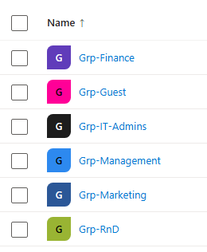
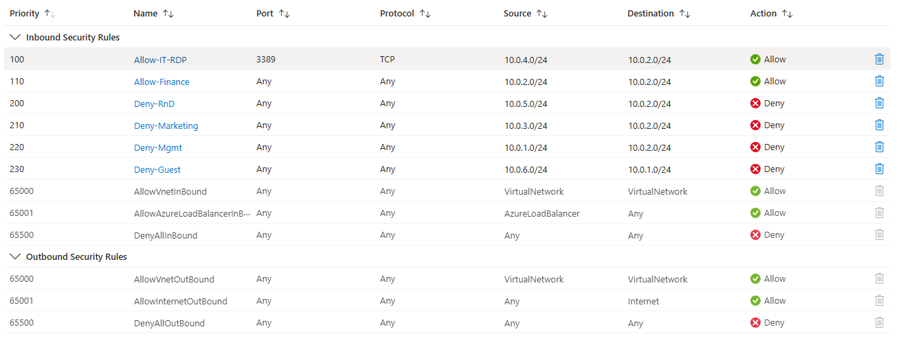
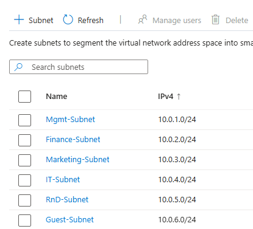

# 🔐 Azure IAM & Network Security Project

**Hands-on Azure cloud project focused on Identity & Access Management (IAM), Role-Based Access Control (RBAC), and network segmentation using Network Security Groups (NSGs).**

---

## 📘 About This Project

While studying for the **AZ-900: Azure Fundamentals** exam, I realized the best way to reinforce concepts like IAM, RBAC, and Zero Trust networking was to build something real in the Azure portal.

# Two Phases:
- Identity & Access Management (IAM)
- Network Segmentation & Security Infrastructure
  
This project simulates a small enterprise cloud deployment using:
- **Microsoft Entra ID (formerly Azure AD)**
- **Custom IAM Roles via RBAC**
- **Multi-Factor Authentication (MFA) simulation**
- **Virtual Network design with subnet isolation**
- **Custom firewall rules using NSGs**
- **PowerShell-based testing**

---

## 🧱 Architecture Overview

- 5 Core Departments: Management, IT, Finance, Marketing, R&D + Guest Wi-Fi
- 6 Segmented Subnets (one per department)
- 1 Azure Virtual Network (10.0.0.0/16)
- 1 VM per subnet
- 20+ users with group-based RBAC enforcement and resource groups
- NSGs used to restrict inter-subnet traffic using Zero Trust

📍 *Zero Trust was enforced by default — deny all inter-subnet traffic unless explicitly allowed.*

---

## 🧪 Key Test Scenarios

| Test Case | Description                                             | Result |
|-----------|---------------------------------------------------------|--------|
| TC1       | Reader (Mgmt) cannot delete resource                    | ✅     |
| TC2       | Contributor (Finance) can deploy new storage account    | ✅     |
| TC3       | Owner (IT) has full access across RGs                   | ✅     |
| TC4       | MFA enforced for IT/Mgmt/Finance/R&D via simulation     | ✅     |
| TC5       | Admin IP can RDP into IT and RnD only                   | ✅     |
| TC6       | RnD blocked from accessing Finance subnet (Zero Trust)  | ✅     |

🛠 Tests were performed via **PowerShell (`Test-NetConnection`)** and **role-based access testing** in the Azure Portal.

---

## 🖼️ Screenshots

| IAM Setup               | NSG Rules (Zero Trust)        | Network Subnets       |
|-------------------------|-------------------------------|------------------------|
|  |  |  |

---

## 📄 Full Documentation

📘 [View Full Project Report (PDF)](docs/azure-project1.pdf)

Contains:
- Tables of IAM groups, RBAC, NSGs
- NSG rule explanations
- Testing steps and results
- Architecture diagram
- Lessons learned

---

## 🔭 What I Learned

- How to plan and segment secure cloud networks
- How to assign roles and enforce least privilege with RBAC
- How to simulate MFA and conditional access with limited tools
- How to test NSG effectiveness using PowerShell and Azure

---
